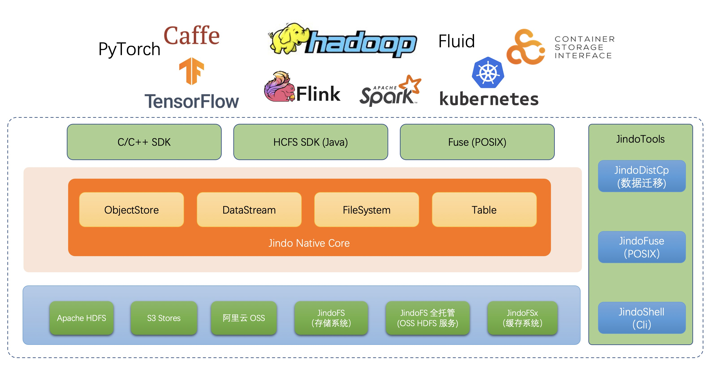

# JindoData 介绍
JindoData 是阿里云开源大数据团队自研的数据湖存储加速套件，面向大数据和 AI 生态，为阿里云和业界主要数据湖存储系统提供全方位访问加速解决方案。JindoData 套件基于统一架构和内核实现，主要包括 JindoFS 存储系统（原 JindoFS Block 模式），JindoFSx 存储加速系统（原 JindoFS Cache 模式），JindoSDK 大数据万能 SDK 和全面兼容的生态工具（JindoFuse、JindoDistCp）、插件支持。

## 主要组件
### JindoFS 存储系统
基于阿里云 OSS 的云原生存储系统，二进制兼容 Apache HDFS，并且基本功能对齐，提供优化的 HDFS 使用和平迁体验。是原 JindoFS Block 模式的全新升级版本。
阿里云 OSS-HDFS 服务（JindoFS 服务) 是 JindoFS 存储系统在阿里云上的服务化部署形态，和阿里云 OSS 深度融合，开箱即用，无须在自建集群部署维护 JindoFS，免运维。OSS-HDFS 服务具体介绍请参考 [OSS-HDFS服务概述](https://help.aliyun.com/document_detail/405089.htm) 。
### JindoFSx 存储加速系统
面向大数据和 AI 生态的云原生数据湖存储加速系统。为大数据和 AI 应用访问各种云存储提供访问加速，支持数据缓存，元数据缓存，P2P加速等功能。JindoFSx 支持管理多个后端存储系统，可以通过统一命名空间进行管理，也可以兼容各系统原生的访问协议，也支持为这些系统提供统一的权限管理。原生优化支持阿里云 OSS 和阿里云 OSS-HDFS 服务，同时也支持业界主要多云对象存储（AWS S3 等）和 Apache HDFS、NAS。是原 JindoFS Cache 模式的全新升级版本。
### 生态支持和工具
* JindoSDK 支持。面向云时代的大数据 Hadoop SDK 和 HDFS 接口支持，内置优化访问阿里云 OSS，较 Hadoop 社区版本性能大幅提升；同时对接支持 JindoFS 存储系统包括服务、JindoFSx 存储加速系统；支持多云对象存储。
* JindoShell CLI 支持。JindoData 除了对接支持 Hadoop/HDFS shell 命令，同时提供一套 JindoShell CLI 命令，从功能、性能上大幅扩展和优化一些数据访问操作。
* JindoFuse POSIX 支持。JindoData 为阿里云 OSS、JindoFS 存储系统和服务、JindoFSx 存储加速系统提供的 POSIX 支持。
* JindoDistCp 数据迁移支持。IDC 机房数据（HDFS）上云迁移和多云迁移利器，支持多种存储数据迁移到阿里云 OSS 和 JindoFS 服务，使用上类似Hadoop DistCp。
* JindoTable 支持。结合计算引擎的使用推出的一套解决方案，支持 Spark、Hive、Presto 等引擎，以及表格式数据的管理功能。
* 生态插件。除了默认提供 JindoSDK 支持 Hadoop，另外还支持 Flink Connector 等插件。

## 发布版本

#### JindoData 4.6.7，2023-04-30，[Release Note](docs/user/4.x/4.6.x/4.6.7/release-notes.md) *[NEW]*
#### JindoData 4.6.6，2023-04-02，[Release Note](docs/user/4.x/4.6.x/4.6.6/release-notes.md)
#### JindoData 4.6.5，2023-03-22，[Release Note](docs/user/4.x/4.6.x/4.6.5/release-notes.md)
#### JindoData 4.6.4，2023-02-15，[Release Note](docs/user/4.x/4.6.x/4.6.4/release-notes.md)
#### JindoData 4.6.2，2022-11-29，[Release Note](docs/user/4.x/4.6.x/4.6.2/release-notes.md)
#### JindoData 4.6.1，2022-11-14，[Release Note](docs/user/4.x/4.6.x/4.6.1/release-notes.md) 
#### JindoData 4.6.0，2022-10-25，[Release Note](docs/user/4.x/4.6.x/4.6.0/release-notes.md)
#### JindoData 4.5.1，2022-09-02，[Release Note](docs/user/4.x/4.5.x/4.5.1/release-notes.md)
#### JindoData 4.5.0，2022-07-25，[Release Note](docs/user/4.x/4.5.x/4.5.0/release-notes.md)
#### JindoData 4.4.0，2022-05-30，[Release Note](docs/user/4.x/4.4.0/release-notes.md)
#### JindoData 4.3.0，2022-03-30，[Release Note](docs/user/4.x/4.3.0/release-notes.md)
#### JindoData 4.2.0，2022-01-30，[Release Note](docs/user/4.x/4.2.0/release-notes.md)
#### JindoData 4.1.0，2022-01-21，[Release Note](docs/user/4.x/4.1.0/release-notes.md)
#### JindoData 4.0.0，2022-01-07，[Release Note](docs/user/4.x/4.0.0/release-notes.md)
#### JindoData 3.x 版本，[原阿里云 EMR SmartData](https://help.aliyun.com/document_detail/121090.html)

## 用户文档
#### 支持阿里云 OSS [用户文档](docs/user/4.x/4.6.x/4.6.4/oss/outline.md)
#### 支持阿里云 OSS-HDFS 服务（JindoFS 服务) [用户文档](docs/user/4.x/4.6.x/4.6.4/jindofs/outline.md)
#### 支持JindoFSx 存储加速系统 [用户文档](docs/user/4.x/4.6.x/4.6.4/jindofsx/outline.md)
#### 支持多云对象存储 [用户文档](docs/user/4.x/4.6.x/4.6.4/jindosdk/outline.md)
#### 支持阿里云 OSS [用户文档](docs/user/3.x/outline.md) （3.x 版本）

## JindoData 下载
JindoData 4.x [下载页面](docs/user/4.x/jindodata_download.md) 
JindoData 3.x [下载页面](docs/user/3.x/jindosdk_download.md)

## 用户交流群

钉钉搜索群号加入： 33413498

扫码入群：

## 常见问题
进入[常见问题](docs/user/faq.md)
