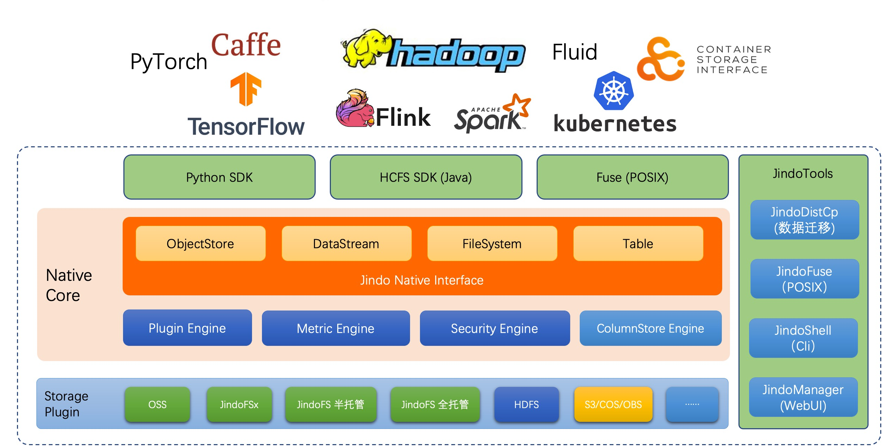

简体中文

## JindoData 介绍

JindoData 是阿里云大数据平台 EMR (E-MapReduce) 的核心自研组件，为各种大数据引擎提供统一的存储优化、缓存优化、计算加速，以及多种扩展功能，涵盖数据访问、数据治理和数据安全。Jindo 在远端存储与计算引擎之间构成一层加速层，与二者的关系如图：

## JindoFS 介绍

JindoFS 作为阿里云基于 OSS 的一套完整的数据湖存储优化方案，完全兼容 Hadoop/Spark 生态，并针对 Spark、Hive、Flink、Presto 等大数据组件和 AI 生态实现了大量扩展和优化。

## JindoSDK 介绍

JindoSDK 是一个简单易用面向 Hadoop、Spark 生态的 OSS 客户端，为阿里云 OSS 提供高度优化的 Hadoop FileSystem 实现。

JindoSDK 4.0 版本新支持了开启 HDFS 服务的 OSS bucket，即 Data Lake Storage，以下简称 DLS。支持 DLS 的 JindoSDK 全面兼容 Hadoop FileSystem 接口，提供了更好的兼容性和易用性，又能兼具OSS的性能和成本优势。

当然您也可以使用 JindoSDK 仅仅作为 OSS 客户端，相对于 Hadoop 社区 OSS 客户端实现，您仍然可以获得更好的性能和阿里云 E-MapReduce 产品技术团队更专业的支持。

## JindoSDK 使用

* [Hadoop/Spark 生态使用 JindoSDK](docs/jindosdk_overview.md)

## JindoSDK 开发

* [Hadoop 使用 JindoSDK 在 IDE 开发调试](docs/jindosdk_ide_hadoop.md)

* [Spark 使用 JindoSDK 在 IDE 开发调试](docs/spark/jindosdk_ide_spark.md)

## 数据迁移最佳实践

* [Jindo Distcp 数据迁移](docs/jindo_distcp/jindo_distcp_overview.md)

## JindoFS 云原生

* [Fluid 结合 JindoFS 介绍和使用](docs/jindo_fluid/jindo_fluid_overview.md)

## JindoFS 相关文章

* [JindoFS 相关文章](docs/jindofs_articles.md)

## 历史版本

* [JindoData 3.x](https://github.com/aliyun/alibabacloud-jindodata/blob/3.x/README.md)