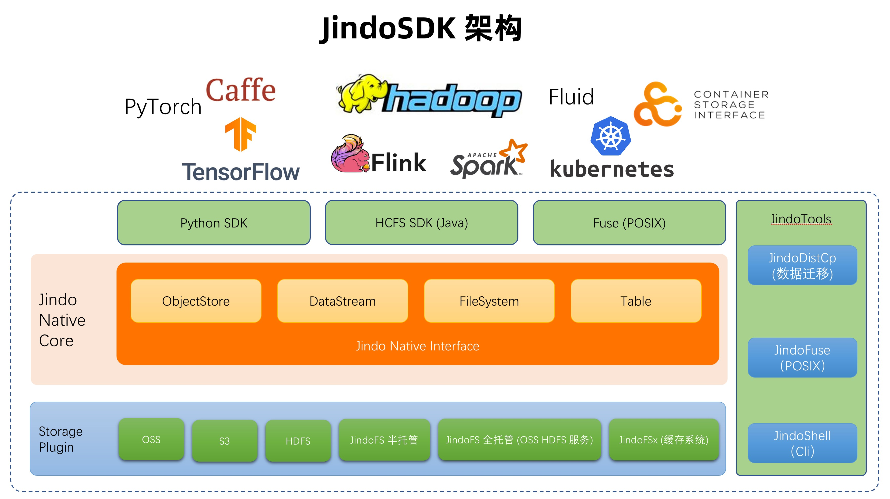

## JindoData 介绍

JindoData 是阿里云大数据平台 EMR (E-MapReduce) 的核心自研组件，为各种大数据引擎提供统一的存储优化、缓存优化、计算加速，以及多种扩展功能，涵盖数据访问、数据治理和数据安全。JindoData 在远端存储与计算引擎之间构成一层加速层，与二者的关系如图：

## OSS 对象存储介绍

JindoFS 作为阿里云基于 OSS 的一套完整的数据湖存储优化方案，完全兼容 Hadoop/Spark 生态，并针对 Spark、Hive、Flink、Presto 等大数据组件和 AI 生态实现了大量扩展和优化。

## JindoFS(存储系统) 介绍

JindoFS 作为阿里云基于 OSS 的一套完整的数据湖存储优化方案，完全兼容 Hadoop/Spark 生态，并针对 Spark、Hive、Flink、Presto 等大数据组件和 AI 生态实现了大量扩展和优化。

## JindoFSx(缓存系统) 介绍

JindoFSx 是一套为远端存储提供缓存服务和访问优化的系统，针对带宽瓶颈的场景，为大数据和 AI 场景提供性能保障。

JindoFSx 支持识别数据冷热，智能缓存热数据，提高缓存利用率，同时支持 OSS 分层存储，为用户节约存储成本。

JindoFSx 4.0 版本还支持权限管理和云原生可观测性，保障数据安全的同时，可以让用户直观地查看数据访问效率和缓存的情况。
