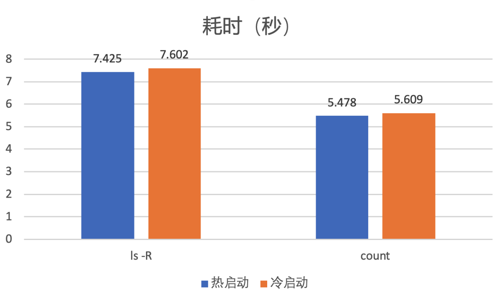
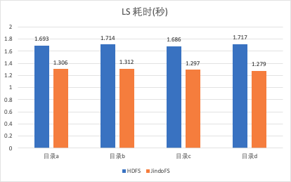

# JindoFS 轻松应对 10亿+文件数

## 介绍

Apache Hadoop FileSystem (HDFS) 是被广为使用的大数据存储方案，其核心元数据服务 NameNode 将全部元数据存放在内存中，因此所能承载的元数据规模受限于内存，单个实例所能支撑的文件个数大约 4亿。[JindoFS块模式](https://help.aliyun.com/document_detail/200157.html)是阿里云基于 OSS 海量存储自研的一个存储优化系统，提供了高效的数据读写加速能力和元数据优化能力。在设计上避免了 NameNode 上的内存限制，与HDFS不同的一点是，JindoFS元数据服务采用RocksDB作为底层元数据存储，RocksDB可以存储在大容量本地高速磁盘，解决了内存容量瓶颈问题。借助于内存缓存，将10%~40%的热文件元数据存放于内存缓存，从而保持稳定的优秀的读写性能。借助于Raft机制，JindoFS元数据服务可以组成3个主备实例，实现服务高可用。JindoFS 实际表现如何，我们在 10亿文件数规模下做了压测，验证 JindoFS 在达到这个规模的时候是否还可以保持稳定的性能。同时在一些关键的元数据操作上，我们也跟 HDFS 做了个测试对比。

<br />

## JindoFS 10亿文件数测试

HDFS NameNode 单个实例所能支撑的文件个数大约 4亿，主要原因是受限于内存大小。除此之外，由于文件数增加，需要处理的DataNode上报块也增加，造成了性能上的巨大抖动。大量文件信息保存在一个很大的FsImage文件，用于下次启动时加载，而很大的FsImage文件使得 NameNode 启动需要花费10分钟以上的时间。
JindoFS 解决了以上系列问题，它使用 RocksDB 存储元数据，相比于 NameNode 可以存储更大规模的文件数，不受限于内存。另外不需要Worker节点上报块信息，没有性能抖动的问题。JindoFS 元数据服务可以在1s内完成启动，毫秒内完成主备节点切换。所以本次测试，我们分别测试了 JindoFS 从1亿文件数增长到10亿文件数，从而测试其是否可以保持稳定的性能。


#### 测试环境
| **主实例组 (MASTER)** | **核心实例组 (CORE)** |
| :-- | :-- |
| 主机数量: 3 <br />机型规格: ecs.g5.8xlarge<br />CPU: 32核<br />内存: 128GB<br />数据盘配置: 640GB ESSD云盘*1 | 主机数量: 4<br />机型规格: ecs.i2g.8xlarge<br />CPU: 32核<br />内存: 128GB<br />数据盘配置: 1788GB 本地盘*2 |


#### 数据集（共4组）
为了测试在不同的元数据规模下，JIndoFS元数据服务的性能。我们准备4组数据。分别是：初始状态（0文件数）、1亿文件数、5亿文件数、10亿文件数。我们使用一份真实的经过用户脱敏的HDFS FsImage文件，将其还原到JindoFS元数据服务当中。文件大小按1：1相应地创建block信息一起存入JindoFS元数据。最终生成的数据集如下。


**元数据磁盘空间占用**

| 0文件数（初始状态） | 1亿文件数 | 5亿文件数 | 10亿文件数 |
| --- | --- | --- | --- |
| 50MB | 17GB | 58GB | 99GB |


**文件大小的分布（以10亿文件数为例）**

| 文件大小 | 比例 |
| --- | --: |
| 0（目录） | 1.47% |
| 0（文件） | 2.40% |
| 大于0，小于等于128KB | 33.66% |
| 大于128KB，小于等于1MB | 16.71% |
| 大于1MB，小于等于8MB | 15.49% |
| 大于8MB，小于等于64MB | 18.18% |
| 大于64MB，小于等于512MB | 9.26% |
| 大于512MB | 2.82% |

另外，目录层级主要分布在5到7级目录居多。数据集的文件大小分布、目录层级分布一定程度上比较接近生产环境的情况。


#### NNBench测试
NNBench全称NameNode Benchmark，是HDFS官方自带的用于测试NameNode性能的工具。由于它使用的是标准的FileSystem接口，因此我们可以使用它来测试JindoFS服务端的性能。NNBench的执行参数如下：
测试写性能
 -operation create_write  -maps 200  -numberOfFiles 5000 -bytesToWrite 512
测试读性能
 -operation open_read  -maps 200  -numberOfFiles 5000 -bytesToWrite 512


启动200个Map Task，每个Task写（读）5000个文件，共计100万个文件。（受测试集群规模限制，实际同时执行Map个数为128个）


测试结果

| 操作 | 0文件数 | 1亿文件数 | 5亿文件数 | 10亿文件数 |
| --- | ---: | ---: | ---: | ---: |
|   create_write | 5836 | 5791 | 5598 | 5153 |
|   open_read | 24853 |   24097 | 23521 |   23567 |


NNBench的结果很好地反馈了随着元数据规模增长，元数据服务的性能变化曲线。通过结果我们可以分析得出：

1. 当达到10亿文件数时，写入TPS受到略微影响，TPS 下降为原先的88%。
1. 当达到5亿文件数时，读TPS受到略微影响，TPS 下降为原先的94%。而10亿文件数时，读TPS保持稳定，跟5亿文件数时基本持平。


#### TPC-DS测试
使用的是官方TPC-DS数据集，5TB数据量，使用的是ORC格式，Spark作为执行引擎进行测试。
测试成绩如下，时间单位秒：


99个查询总耗时对比：

| 查询 | 0文件数 | 1亿文件数 | 5亿文件数 | 10亿文件数 |
| :--- | ---: | ---: | ---: | ---: |
| 总计 | 13032.51 | 13015.226 | 13022.914 | 13052.728 |


通过观察发现，去掉误差影响，随着元数据规模从0增加到10亿文件数，TPC-DS成绩基本不受影响。


#### ls -R/count测试
上述NNBench工具主要测试高并发下元数据服务单点写入、单点查询的性能。然而，文件列表导出（ls -R)操作、文件大小统计（du/count)操作也是用户使用频率较高的操作，这些命令的执行时间，反应了元数据服务遍历操作的执行效率。
我们使用两个样本数据进行测试：

1. 对一个表（半年数据，154个分区，270万个文件）执行ls -R操作，统计执行时间，使用以下命令

```
time hadoop fs -ls -R jfs://test/warehouse/xxx.db/tbl_xxx_daily_xxx > /dev/null
```

1. 对一个数据库（50万个目录，1800万个文件）执行count操作，统计执行时间，使用以下命令

```
time hadoop fs -count jfs://test/warehouse/xxx.db
```

测试结果（单位：秒）

| 操作 | 1亿文件数 | 5亿文件数 | 10亿文件数 |
| --- | ---: | ---: | ---: |
| ls -R | 7.321 | 7.322 | 7.425 |
| count | 5.425 | 5.445 | 5.478 |


测试结果发现，对于遍历（ls -R/count)相同数量的文件（目录），元数据服务的性能保持稳定，不会随着元数据总量的增长有所变化。


对于10亿级别的文件数，磁盘占用有近100GB，JindoFS元数据服务只会缓存部分热文件元数据，那么元数据文件的page cache是否会对性能有所影响？我们为此做了测试。
热启动：直接重启元数据服务服务，此时系统存在page cahe。
冷启动：我们使用命令 **echo 3 > /proc/sys/vm/drop_caches**清空缓存，并重启元数据服务。

测试结果如下（使用10亿文件数据集）



通过观察发现，冷启动情况下，这些操作耗时增加了约0.2秒，只受到细微的影响。

<br />

## 与HDFS横向对比测试

通过上面的测试我们得知 JindoFS 在10亿文件数下，依然保持了稳定的性能。另外我们补充测试了 JindoFS 跟 HDFS 的对比。由于 HDFS 存储10亿规模文件数需要极高规格的机器，因此本轮测试我们主要测试1亿文件数场景，我们通过横向对比list、du、count等常用操作，对比两者的性能差异。

#### 样本说明
抽取 a, b, c, d 共 4 组目录，
目录 a：Hive warehouse目录包含 31.7万目录，1250万文件；
目录 b：某 database 目录包含 1万2目录，32万文件；
目录 c：某 table 目录包含 91个目录，7.7万文件；
目录 d：spark 结果存放目录包含4.2万目录，7.1万文件；


#### 测试结果（用时更短，性能更好）
**单层 list 操作**
对单层目录进行展开并输出，采样方法：

```
time hadoop dfs -ls [DIR] > /dev/null
```




**递归 list 操作**
对目录进行逐层展开并输出，采样方法：
```
time hadoop dfs -ls -R [DIR] > /dev/null
```


**du 操作**
对目录占用的存储空间进行计算，采样方法：
```
time hadoop dfs -du [DIR] > /dev/null
```


**count 操作**
对目录的文件(夹)数量、容量进行计算，采样方法：
```
time hadoop dfs -count [DIR] > /dev/null
```


#### 结果分析
通过上述测试结果，可以明显发现 JindoFS 在list、du、count等常用操作上速度明显快于 HDFS。分析原因，HDFS NameNode 内存中使用了全局的读写锁，所以对于查询操作，尤其是对目录的递归查询操作都需要拿读锁。拿锁之后使用了单线程串行的方式做目录递归操作，速度较慢。拿锁时间长继而又影响了其它rpc请求的执行。JindoFS 从设计上解决了这些问题。它对目录的递归操作使用了多线程并发加速，因此在对目录树的递归操作上速度更快。同时使用了不同的目录树存储结构，配合细粒度锁，从而减少了多个请求之间的影响。

<br />

## 总结

JindoFS 块模式可以轻松地存储10亿+文件数，并且提供高性能的读写请求处理能力。跟 HDFS NameNode 相比占用内存更小、性能更好、运维更加简单。我们可以利用 JindoFS 作为存储引擎，将底层数据存放在对象存储（比如OSS）上，并且利用 JindoFS 的本地缓存加速能力，组成一个云上稳定、可靠、高性能的大数据存储方案，给上层计算分析引擎提供强大有力的支撑。除此之外，JindoFS 在数据缓存、弹性扩容、权限等特性上均有很好的支持，具体可以[参考链接](./jindofs_block_vs_hdfs.md)。


另外，JindoFS SDK可以单独使用，替代Hadoop社区OSS客户端实现。相比于Hadoop社区实现，JindoFS SDK对读写OSS的能力上做了很多的性能优化，可以访问[github repo](/docs/jindofs_sdk_overview.md)下载使用。
