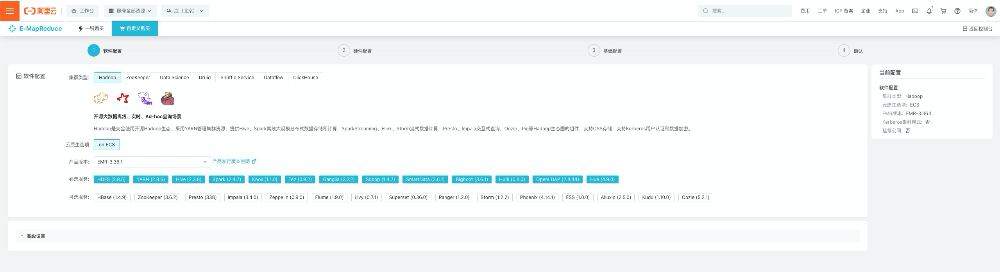
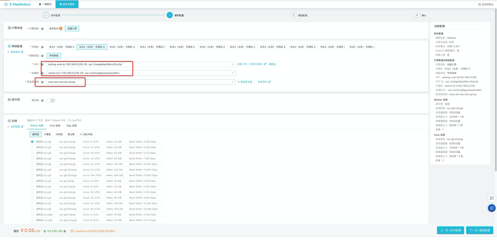
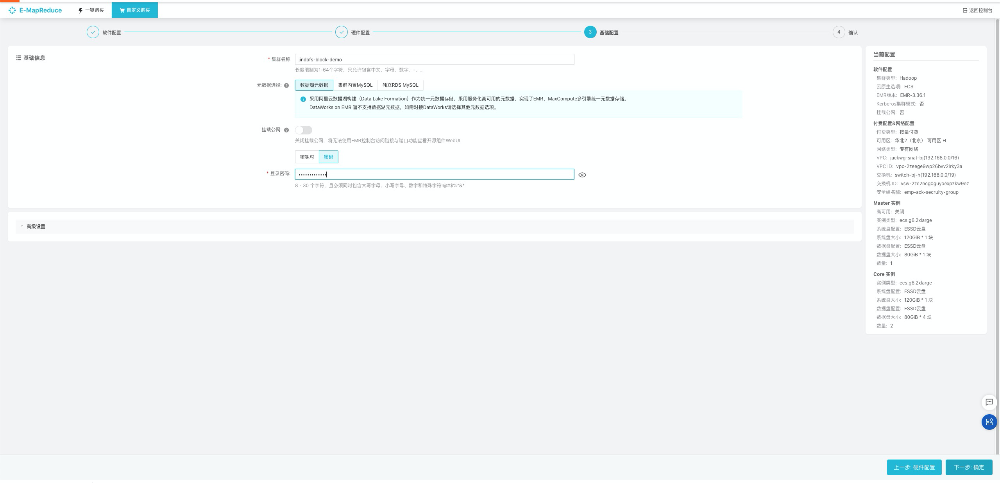
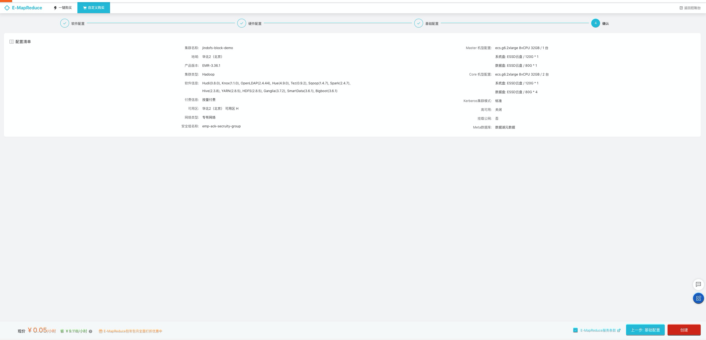
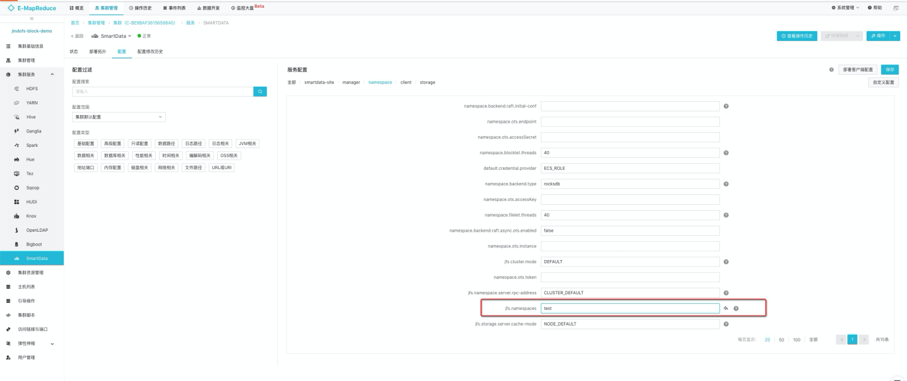
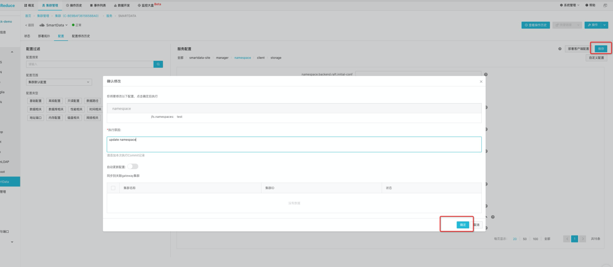
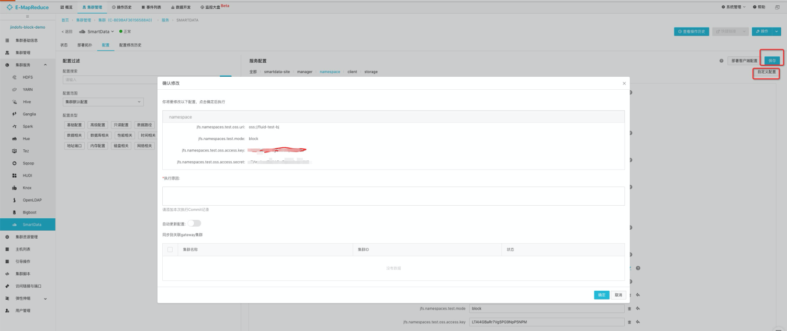
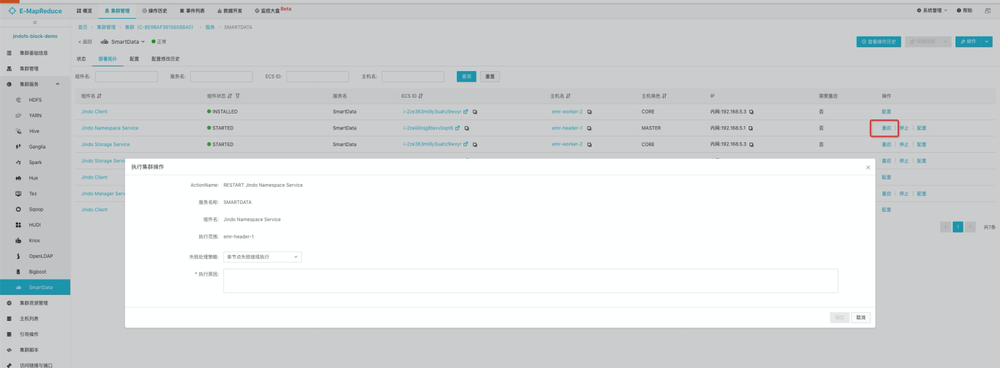
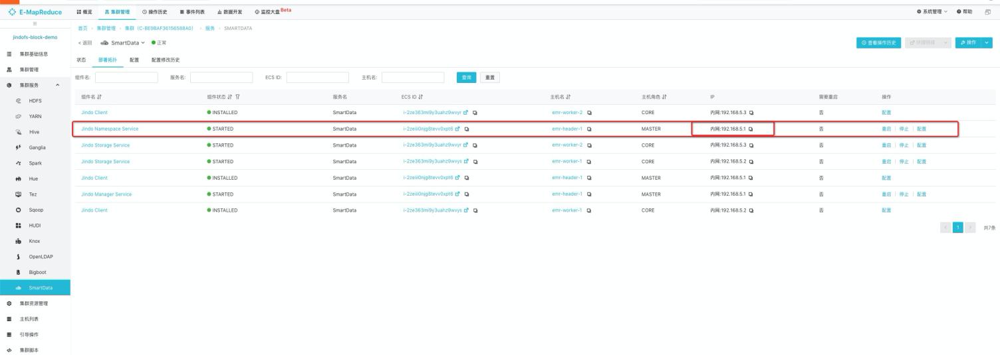

本文介绍一种通过jindofs，在ack集群中，读取外部存储中block数据的方法。这里的外部存储以oss为例，hdfs等同理。
<a name="F8rnT"></a>
# 目标

1. 以hadoop协议，通过jindofs读取oss中的block数据。
<a name="XFPdY"></a>
# 前提条件

1. 一个有访问权限的oss，且其中有以block模式写入的数据。
1. ack集群和hadoop集群网络互通（可ping通）。
<a name="L9W8Q"></a>
# 步骤总览

1. （可选）创建单master模式的hadoop集群。
1. 安装fluid。
1. 配置smartdata的存储介质为oss。
1. 在ack集群创建dataset（即pv/pvc）。
1. 在pod中挂载pvc，读取数据。
<a name="wjeJO"></a>
# 操作过程
<a name="mg8hb"></a>
## 创建hadoop集群
   此步骤可选，如果已有hadoop集群，则可跳过此步骤。如果没有，请在[emr控制台](https://emr.console.aliyun.com/?)，参考如下步骤创建hadoop集群。<br />
    <br />
    <br />
   此处的vpc和网关尽可能和发起访问的ack集群保持一致。<br />
    <br />
   
<a name="srsSs"></a>
## 安装fluid

1. 检查是否已安装fluid，如果有则先卸载。
```bash
$helm list -A |grep "fluid"
NAME                     	NAMESPACE   	REVISION	UPDATED                                	STATUS  	CHART                          	APP VERSION
fluid                    	fluid-system	1       	2021-08-13 14:34:51.549745325 +0800 CST	deployed	fluid-0.6.0                    	0.6.0-ed9b1be
$helm delete fluid -n fluid-system
release "fluid" uninstalled
```

2. 下载支持jindofs block读取模式的[fluid-0.6.0](http://smartdata-binary.oss-cn-shanghai.aliyuncs.com/fluid/FuseOnly/fluid-0.6.0.tgz)，并安装。
```bash
$wget http://smartdata-binary.oss-cn-shanghai.aliyuncs.com/fluid/FuseOnly/fluid-0.6.0.tgz
$helm install fluid fluid-0.6.0.tgz -n fluid-system
NAME: fluid
LAST DEPLOYED: Fri Aug 13 17:26:33 2021
NAMESPACE: fluid-system
STATUS: deployed
REVISION: 1
TEST SUITE: None
```

3. 确认fluid正常启动
```bash
$kubectl get po -n fluid-system
NAME                                      READY   STATUS    RESTARTS   AGE
csi-nodeplugin-fluid-5pjm8                2/2     Running   0          46s
csi-nodeplugin-fluid-r6fkj                2/2     Running   0          46s
csi-nodeplugin-fluid-w6xp5                2/2     Running   0          46s
dataset-controller-5c875759f9-g5g9b       1/1     Running   0          46s
jindoruntime-controller-84d586b49-c6ll7   1/1     Running   0          46s
```
<a name="XHPPb"></a>
## 配置smartdata的namespace
1 在[emr控制台](https://emr.console.aliyun.com/?)，smartdata中新增namespace配置并保存(注意不要忘记保存)。<br />
    <br />
    <br />
2 新增oss的访问配置，并保存(注意不要忘记保存)。<br />
    <br />
3 重启ns service（务必要重启）。<br />
   
<a name="rWwnD"></a>
## 在ack集群创建dataset
在ack集群中，准备读取数据的dataset.yaml，具体内容参考：
```bash
$echo > resource.yaml << apiVersion: v1
kind: Secret
metadata:
  name: mysecret
stringData:
  AccessKeyId: ${OSS_ACCESS_ID}
  AccessKeySecret: ${OSS_ACCESS_KEY}
---
apiVersion: data.fluid.io/v1alpha1
kind: Dataset
metadata:
  name: hadoop
spec:
  mounts:
    - mountPoint: ${SMARTDATA_NAMESPACE_IP}:8101
      name: hadoop
---
apiVersion: data.fluid.io/v1alpha1
kind: JindoRuntime
metadata:
  name: hadoop
spec:
  replicas: 1
  secret: mysecret
  master:
    disable: true
  worker:
    disable: true
  fuse:
    global: true
EOF
```
其中

1. OSS_ACCESS_ID，OSS_ACCESS_KEY与配置smartdata的namespace时相同。
1. SMARTDATA_NAMESPACE_IP，在[emr控制台](https://emr.console.aliyun.com/?)如下位置获取。
  
    <br />
执行dataset.yaml，创建fluid dataset：
```bash
$kubectl apply -f resource.yaml
secret/mysecret created
dataset.data.fluid.io/hadoop created
jindoruntime.data.fluid.io/hadoop created
```
检查jindo-fs pod状态
```bash
$kubectl get po
hadoop-jindofs-fuse-5kkr4                                         1/1     Running     0          5m55s
hadoop-jindofs-fuse-hk6sn                                         1/1     Running     0          5m55s
hadoop-jindofs-fuse-xk7zk                                         1/1     Running     0          5m55s
```
验证pv，pvc状态
```bash
$kubectl get pv default-hadoop
NAME             CAPACITY   ACCESS MODES   RECLAIM POLICY   STATUS   CLAIM            STORAGECLASS   REASON   AGE
default-hadoop   100Gi      ROX            Retain           Bound    default/hadoop   fluid                   4m31s

$kubectl get pvc hadoop
NAME     STATUS   VOLUME           CAPACITY   ACCESS MODES   STORAGECLASS   AGE
hadoop   Bound    default-hadoop   100Gi      ROX            fluid          5m12s
```
<a name="lQ0hV"></a>
## 访问dataset pvc中的数据
在ack集群，创建pod，访问dataset（对应一个pv/pvc）中的数据。<br /> 1. 登陆emr集群的任意节点，并创建一个文件
```bash
$ssh root@{EMP_NODE_IP}
$hadoop fs -put hello.txt jfs://test/
```

2. 在ack集群确认文件目录，及内容
```bash
$kubectl exec hadoop-jindofs-fuse-5rqs9 -- ls /jfs/test/
/jfs/test/hello.txt
```

3. 创建nginx pod，挂载default-hadoop pvc，读取该文件
```yaml
apiVersion: v1
kind: Pod
metadata:
  name: jindo-fs-test
  namespace: default
spec:
  containers:
    - name: nginx
      image: nginx
      volumeMounts:
        - mountPath: /data
          name: jindo-fs
      resources:
        requests:
          cpu: 100m
          memory: 1Gi
  volumes:
    - name: jindo-fs
      persistentVolumeClaim:
        claimName: hadoop
```
创建测试nginx pod挂载hadoop pvc，确认pod正常启动：
```bash
$kubectl get po jindo-fs-test
NAME            READY   STATUS    RESTARTS   AGE
jindo-fs-test   1/1     Running   0          118s
```
尝试读取文件：
```bash
 $kubectl exec jindo-fs-test -- ls /data/test
 hello.txt
```
<a name="HHXz3"></a>
# 问题排查

1. jindo-fs pod crash
   1. 首先确认读取模式是否是block。
   1. 确认oss配置是否正确
   1. 确认配置之后，ns服务是否重启。
2. 在ack集群ping不通emr namespace server

如果无法加入同一个安全组，则需要在emr的安全组中，入方向，放行所有来自ack集群的请求。

3. jindo-fs读取异常，在什么地方查找jindo-fs日志。

找到任意一个jindofs-fuse的pod，执行入下命令，即可找到jindo-fs的日志。
```bash
kubectl exec hadoop-jindofs-fuse-7lzbm -- ls /tmp/bigboot-log/default/hadoop/bigboot/log
core-jboot-20210813-143630-1113696.core
core-jboot-20210813-143632-1113815.core
core-jboot-20210813-143648-1114415.core
core-jboot-20210813-143716-1115101.core
core-jboot-20210813-143808-1116371.core
core-jboot-20210813-143940-1118631.core
core-jboot-20210813-144222-1122647.core
core-jboot-20210813-144725-1129802.core
core-jboot-20210813-145236-1137197.core
core-jboot-20210813-145444-1140385.core
core-jboot-20210813-145446-1140522.core
core-jboot-20210813-145502-1140843.core
core-jboot-20210813-145530-1141565.core
core-jboot-20210813-145622-1142913.core
core-jboot-20210813-145754-1145210.core
core-jboot-20210813-150042-1149195.core
jboot-20210813-143630-1113696.LOG
jboot-20210813-143632-1113815.LOG
jboot-20210813-143648-1114415.LOG
jboot-20210813-143716-1115101.LOG
jboot-20210813-143808-1116371.LOG
jboot-20210813-143940-1118631.LOG
jboot-20210813-144222-1122647.LOG
jboot-20210813-144725-1129802.LOG
jboot-20210813-145236-1137197.LOG
jboot-20210813-145444-1140385.LOG
jboot-20210813-145446-1140522.LOG
jboot-20210813-145502-1140843.LOG
jboot-20210813-145530-1141565.LOG
jboot-20210813-145622-1142913.LOG
jboot-20210813-145754-1145210.LOG
jboot-20210813-150042-1149195.LOG
jboot-20210813-150554-1156279.LOG
jboot-20210813-162754-1282069.LOG
jboot-20210813-163922-1299578.LOG
jboot-20210813-163946-1300311.LOG
jboot-20210813-164325-1306227.LOG
jboot-20210813-165022-1317070.LOG
jboot.LOG
```


