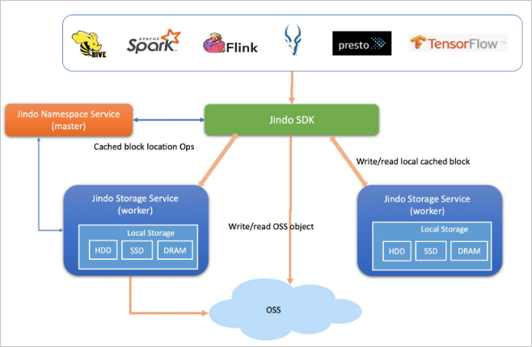
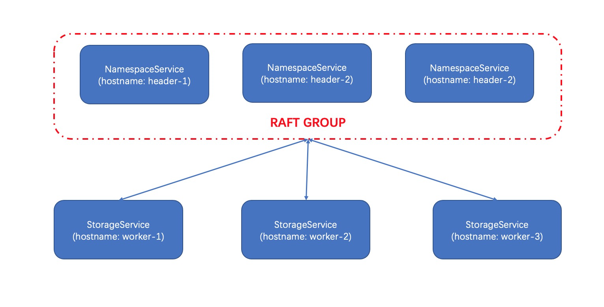

# JindoFS Block模式部署

JindoFS 提供了Block模式，该模式下文件元数据由JindoFS Namespace服务进行管理，数据以Block的形式存放OSS上，同时本地缓存一副本数据用以加速数据范文请求。

本文将详细说明如何在计算集群上部署 Jindo Block模式。

## JindoFS Block模式架构概述
下图为 JindoFS Block模式架构图，主要包含以下3个组件模块，包括两个服务组件（Namespace Service 和 Storage Service）以及一个客户端：
* Jindo Namespace Service：负责缓存块元数据管理以及数据块管理；
* Jindo Storage Service：部署在各个存储节点上，管理本地一副本的数据；
* Jindo SDK：提供标准 Hadoop Filesystem 客户端访问 JindoFS。


## 示例部署拓扑

下图为示例的部署拓扑图，其中在header-1, header-2, header-3节点上部署Namespace高可用服务，在worker-1, worker-2, worker-3部署Storage 服务, 本文以JindoFS 3.6.0版本为例， 对应软件包版本为b2smartdata-3.6.0.tar.gz, 并且配置名为my-jfs的namespace，my-jfs的namespace数据存放到oss://my-jfs.oss-cn-shanghai.aliyuncs.com/my-jfs的OSS路径上。



## 部署配置 JindoFS SDK

### 安装jar包
下载并安装最新的jar包 jindofs-sdk-x.x.x.jar ([下载页面](/docs/jindofs_sdk_download.md))，针对各常用大数据组件的 JindoFS SDK 安装说明详见([Hadoop/Spark 生态使用 JindoFS SDK](/docs/jindofs_sdk_overview.md))。


## 部署 JindoFS 服务

### 下载最新安装包

下载最新 Release 包 b2smartdata-3.6.0.tar.gz ([下载页面](/docs/jindofs_sdk_download.md))。

### 解压
```
tar -xzvf b2smartdata-3.6.0.tar.gz -C /opt
```
将b2smartdata-3.6.0.tar.gz解压到/opt目录下， 在每个安装结点（示例部署拓扑中header-1, worker-1, worker-2, worker-3）上执行上述操作。

### 配置 bigboot.cfg
编辑 /opt/b2smartdata-3.6.0/conf 文件夹下配置文件 bigboot.cfg  包含以下主要内容，并将配置文件部署到所有所需节点上（示例部署拓扑中header-1, worker-1, worker-2, worker-3）:
```
[bigboot]
logger.dir = /tmp/bigboot-log # 日志目录

[bigboot-client] # 客户端配置
client.storage.rpc.port = 6101 # Storage service 端口
client.namespace.rpc.address = header-1:8101,header-2:8101,header-3:8101 # Namespace service 地址及端口

[bigboot-storage] # Storage service 配置
storage.rpc.port = 6101 # Storage service 监听端口
storage.data-dirs = /mnt/disk1/bigboot,/mnt/disk2/bigboot,/mnt/disk3/bigboot,/mnt/disk4/bigboot # 本地磁盘目录
storage.data-dirs.capacities = 527371075584,527371075584,527371075584,527371075584 # 缓存磁盘大小
storage.namespace.rpc.address = header-1:8101,header-2:8101,header-3:8101 # Namespace service 地址及端口
storage.watermark.high.ratio=0.4 # 缓存上水位
storage.watermark.low.ratio=0.2 # 缓存下水位

[bigboot-namespace] # Namespace service 配置
namespace.rpc.port = 8101 # Namespace service 监听端口
namespace.meta-dir = /mnt/disk1/bigboot # 元数据存放目录

# Namespace 配置
namespace.backend.type = raft # Namespace元数据后端
namespace.backend.raft.initial-conf = header-1:8103:0,header-2:8103:0,header-3:8103:0 # raft示例监听地址

jfs.namespaces = my-jfs
jfs.namespaces.my-jfs.oss.uri = oss://my-jfs.oss-cn-shanghai.aliyuncs.com/my-jfs
jfs.namespaces.my-jfs.mode = block
jfs.namespaces.my-jfs.oss.access.key = ACCESS_KEY
jfs.namespaces.my-jfs.oss.access.secret = ACCESS_SECRET

[bigboot-manager] # Manager service 配置
manager.address=header-1 # Manager服务地址
manager.rpc.port=8104 # Manager serivce 监听端口
manager.namespace.rpc.address=header-1:8101,header-2:8101,header-3:8101 # Namespace service 地址及端口
```
必要配置说明：
1. 需要将[bigboot-client] 中的参数 client.namespace.rpc.address、 [bigboot-storage] 中的参数 storage.namespace.rpc.address 以及 [bigboot-manager] 中的参数 manager.namespace.rpc.address 修改为 JindoFS 集群的 Namespace 服务的所在节点地址（hostname 或者 ip 均可），其中 8101 为 Namespace 服务 RPC 的端口号， 需要与 [bigboot-namespace] 中的参数 namespace.rpc.port 中的端口号一致；
2. [bigboot-storage] 中需配置好数据缓存相关参数，storage.data-dirs 为缓存目录，可以指定多个，以逗号隔开；storage.data-dirs.capacities 为每块磁盘大小，数量应与 storage.data-dirs 一致；storage.watermark.high.ratio 表示磁盘使用量的上水位比例（0到1之间的小数），每块数据盘的缓存数据目录占用的磁盘空间到达上水位即会触发清理，并且 Storage Service 会确保缓存空间占用不超过上水位；storage.watermark.low.ratio 表示使用量的下水位比例（0到1之间的小数，需小于上水位），触发清理后会自动清理冷数据，将缓存数据目录占用空间清理到下水位。


### 配置环境变量
以 b2smartdata-3.6.0 安装在 /opt 为例：
```
export BIGBOOT_SMARTDATA_HOME=/opt/b2smartdata-3.6.0/
export BIGBOOT_JINDOSDK_HOME=/opt/b2smartdata-3.6.0/
export B2SDK_CONF_DIR=/opt/b2smartdata-3.6.0/conf
export SMARTDATA_CONF_DIR=/opt/b2smartdata-3.6.0/conf
```
可将环境变量配置到 /etc/profile.d/bigboot.sh 中，并确认部署到所有节点。

### 启动 JindoFS 缓存服务
在 header-1, header-2, header-3 节点启动 Namespace服务

```
cd /opt/b2smartdata-3.6.0/
sh sbin/start-namespace.sh
```

可以通过以下命令停止Namespace 服务：
```
cd /opt/b2smartdata-3.6.0/
sh sbin/stop-namespace.sh
```

在worker-1, worker-2, worker-3 节点上启动Storage 服务

```
cd /opt/b2smartdata-3.6.0/
sh sbin/start-storage.sh
```

可以通过以下命令停止Storage 服务：
```
cd /opt/b2smartdata-3.6.0/
sh sbin/stop-storage.sh

### 组件服务状态检查
缓存服务的进程可以通过以下命令查看，日志文件可在 [Bigboot] 中 logger.dir 配置的目录下查看
```
ps -aux | grep b2-storage
ps -aux | grep b2-namespace
```
另外，JindoFS Manager 服务提供了 Web 页面可以更加直观地查看缓存服务的状态信息，可以通过以下脚本启动 Manager 服务：
```
cd /opt/b2smartdata-3.6.0/
sh sbin/start-manager.sh
```
Manager 服务监听在 manager.rpc.port 配置的端口上（默认为 8104），可以通过 http://{server_address}:8104 访问 Web UI 功能（页面详情可参考[访问JindoFS Web UI](https://help.aliyun.com/document_detail/213351.html?spm=a2c4g.11186623.6.1111.460f6194PFUUQf))。


