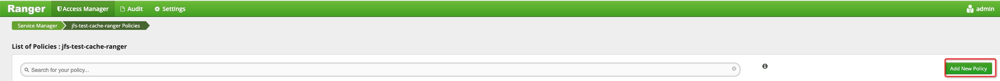
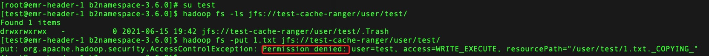

# JindoFS 使用 Ranger 的鉴权方案
## 背景
Apache Ranger 提供集中式的权限管理框架，可以对 Hadoop 生态中的多个组件进行细粒度的权限访问控制。当用户将数据存放在阿里云 OSS 时，则是通过阿里云 RAM 产品创建或管理 RAM 用户，对RAM用户实现对 OSS 资源的访问控制。
为维持大数据客户的使用习惯，通过 JindoFS NameSpace 接入 Ranger 的客户端，方便用户统一管理大数据组件权限。

## 访问 OSS 鉴权流程
* OSS 的访问密钥 AccessKey（AK）统一在 JindoFS NameSpace 中设置，避免用户在客户端配置明文密钥，建议只允许管理员操作和管理 NameSpace 服务；
* JindoFS SDK 提供标准 Hadoop Filesystem 客户端，将访问 OSS 的请求会发送至 NameSpace 服务；
* JindoFS NameSpace Service 负责集成 Ranger 客户端，周期性将权限策略从 Ranger 服务端同步到本地；
* NameSpace 服务在收到 JindoFS SDK 的鉴权请求后进行细粒度的权限校验；
* 通过权限校验后 JindoFS SDK 则可以使用 NameSpace 服务颁发的 AK 访问 OSS。

  

注：若 NameSpace 部署的节点为阿里云 ECS 节点，可以通过配置安全组，限制访问 NameSpace 的客户端。

## 前提条件
集群已部署好 JindoFS NameSpace 服务。
请参考 [JindoFS NameSpace 安装文档](./jindofs_ns_deploy.md) 完成安装。

## 启用 JindoFS Ranger权限
在 bigboot.cfg 文件的 [bigboot-namespace] section 下对应的 namespace 配置项中添加 Key 为 jfs.namespaces.<namespace>.permission.method，Value 为 ranger 的配置项。
以 test-cache-ranger namespace 为例:
```
[bigboot-namespace]
jfs.namespaces.test-cache-ranger.permission.method = ranger
```

## 配置 Ranger Admin URL
```
[bigboot-namespace]
ranger.plugin.jfs.policy.rest.url = http://hostname:port
```
hostname 和 port 为 Ranger Admin 所在的节点地址和端口号。

## 重启 Namespace
```
sh sbin/stop-namespace.sh
sh sbin/start-namespace.sh
```

## 进入 Ranger UI 页面， 添加 HDFS Service


| 参数 | 描述 |
| :--- | ---: |
| Service Name | 固定格式：jfs-{namespace_name}。 <br /> 例如：jfs-test。 |
| Username | 自定义 |
| Password | 自定义 |
| Namenode URL | 输入jfs://{namespace_name}/ |
| Authorization Enabled | 使用默认值No |
| Authentication Type | 使用默认值Simple |
| dfs.datanode.kerberos.principal | 不填写 |
| dfs.namenode.kerberos.principal | 不填写 |
| dfs.secondary.namenode.kerberos.principal | 不填写 |
| Add New Configurations | 不填写 |

以 test-cache-ranger 为例：


## 配置用户权限
### 单击配置好的 jfs-test-cache-ranger 服务


### 单击右上角的 Add New Policy


### 配置相关参数
| 参数 | 描述 |
| :--- | ---: |
| Policy Name | 策略名称，可以自定义 |
| Resource Path | 资源路径 |
| recursive | 子目录或文件是否集成权限 |
| Select Group | 指定添加此策略的用户组 |
| Select User | 指定添加此策略的用户 |
| Permissions | 选择授予的权限 |

以授予 test 用户 /user/test 路径的 Read 和 Execute 权限为例：


### 检查用户的读写权限
以上 test 用户 在 /user/test 路径为的权限的例子，具有 Read 和 Execute 权限，没有 Write 权限：


