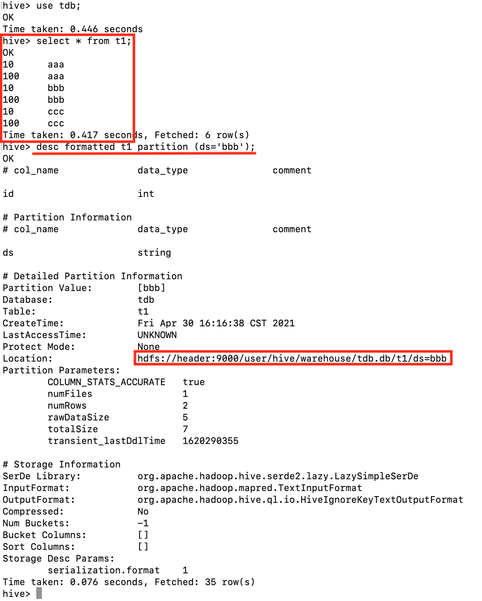

# JindoTable Hive 数据迁移（HDFS_OSS）功能 MoveTo 命令简介

HDFS 受限于集群规模和成本因素，无法无限扩展，容量存在瓶颈。云厂商提供的对象存储可以作为 HDFS 的替代或补充，扩展云上 Hadoop 平台的存储能力。
本工具用于把 Hive 数据根据分区键规则筛选，在 HDFS 和 OSS 之间转移分区。

## 安装说明

1. 将 jindofs-sdk-3.5.0.jar 与 Hadoop 集成，配置方法参考一篇 Github 文档：
[https://github.com/aliyun/alibabacloud-jindofs/blob/master/docs/jindofs_sdk_how_to_hadoop.md](https://github.com/aliyun/alibabacloud-jindofs/blob/master/docs/jindofs_sdk_how_to_hadoop.md) 

2. 下载[压缩包](https://smartdata-binary.oss-cn-shanghai.aliyuncs.com/JindoTable-moveto/JindoTable-MoveTo.zip)并解压，保持 *b2jindosdk-current* 的目录结构并放置于集群 master 节点，然后配置路径：

```shell
export BIGBOOT_JINDOSDK_HOME=/path/to/b2jindosdk-current
export PATH=$PATH:BIGBOOT_JINDOSDK_HOME/bin 
```

3. Hadoop 与 Hive 环境：
(1) 确保 `hadoop classpath` 能够返回合理结果
(2) 确保客户端环境变量 $HIVE_HOME 与 $HIVE_CONF_DIR 正确配置 

## 使用说明
使用 jindo table -help moveTo 查看参数配置。
jindo table -moveTo -t <dbName.tableName> -d <destination path> [-c "<condition>" | -fullTable] [-b/-before <before days>] [-p/-parallel <parallelism>] [-o/-overWrite] [-r/-removeSource] [-e/-explain] [-l/-logDir <log directory>]

```shell
  <dbName.tableName>      要移动的表。
  <destination path>      目标路径，为表级别的路径，分区路径会在这个路径下自动创建。
  <condition>             分区过滤条件表达式，支持基本运算符，不支持udf。
  <before days>           根据分区创建时间，创建时间超过给定天数的分区进行移动。
  <parallelism>           整个moveTo任务的最大task并发度，默认为1。
  -o/-overWrite           是否覆盖最终目录。分区级别覆盖，不会覆盖本次移动不涉及的分区。
  -r/-removeSource        是否在移动完成后删除源路径。
  -e/-explain             如果指定explain模式，不会触发实际操作，仅打印会同步的分区。
  <log directory>         本地日志目录，默认为/tmp/<current user>/
```

## 使用示例

1. 有一个 HDFS 上的 Hive 分区表，如下图所示：



2. 想把 bbb 和 ccc 分区移动到 OSS，先用 explain 模式看看会移动的分区是否符合预期：


3. 去掉 explain，真正移动分区


4. 执行完成后，检查数据，数据已经在 OSS ：


5. 再移回 HDFS，结果失败了，会显示失败原因，原来是目标目录非空，提示可以使用 -overWrite 清空目标目录


6. 使用 -overWrite 强制覆盖


