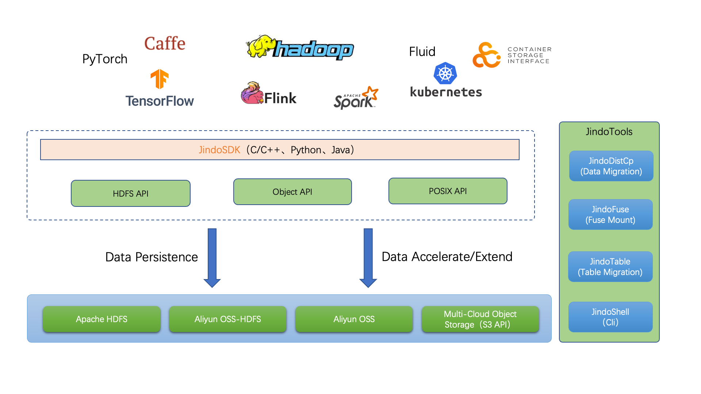

# JindoData User Guide

JindoData is a self-developed data lake acceleration suite by Alibaba Cloud's Big Data team, targeting the big data and AI ecosystems. It provides comprehensive access acceleration solutions for major data lake storage systems on Alibaba Cloud and beyond. The JindoData suite consists of a unified architecture and kernel, including JindoFS (originally JindoFS Block mode), JindoCache storage accelerator (formerly JindoFS Cache mode), JindoSDK – a versatile big data SDK, along with fully-compatible ecosystem tools (such as JindoFuse, JindoDistCp) and plugin support.

## Downloading and Installing JindoSDK

JindoSDK serves as the standard client for accessing JindoData components. To install and verify it, refer to [JindoSDK Download](jindosdk/jindosdk_download.md) and [JindoSDK Quick Start](jindosdk/jindosdk_quickstart.md). For multi-platform support, consult [JindoSDK Multi-Version Support](jindosdk/jindosdk_deployment_multi_platform.md).

## Upgrading JindoSDK

As an actively updated client providing continuous updates with new features and performance improvements for Alibaba Cloud EMR data lakes, we recommend users stay up-to-date with the latest JindoSDK version for ongoing support and optimal experience. A convenient script is available to assist in upgrading JindoSDK across your cluster; please refer to the [JindoSDK Upgrade Documentation](upgrade/emr2_upgrade_jindosdk.md).

## Usage Scenarios

### Using JindoSDK in Hadoop Ecosystem

See [Using JindoSDK in Hadoop Ecosystem](jindosdk/jindosdk_deployment_hadoop.md)

### Using JindoSDK in AI Ecosystem

See [Using JindoSDK in AI Ecosystem](jindosdk/jindosdk_deployment_ai.md)

### Using Jindo Python SDK

See [Jindo Python SDK Quick Start](jindosdk/python/pyjindo_quickstart.md)

### Using Jindo TensorFlow Connector

See [Using JindoTensorFlowConnector](jindosdk/tensorflow/jindosdk_on_tensorflow.md)

### Using JindoFuse

See [JindoFuse Quick Start](jindofuse/jindofuse_quickstart.md)

### Using Jindo Flink Sink

See [Using Jindo Flink Sink](jindosdk/flink/jindosdk_on_flink.md)

### Using JindoRuntime with Fluid

See [Overview of Using JindoRuntime with Fluid](fluid-jindoruntime/jindo_fluid_overview.md)

### Authentication Solutions for JindoData

See [Authentication in JindoData](jindoauth/jindoauth_emr-next_kerberos.md)

### Data Copy Tools - JindoDistCp

See [Quick Start for JindoDistCp](jindotools/jindodistcp_quickstart.md)

### Warehouse Migration Tool - JindoTable MoveTo

See [Using JindoTable MoveTo](jindotools/jindotable_moveto.md)

### Warehouse Tier Management Tool - JindoTable SetStorage

See [Using JindoTable SetStorage Class](jindotools/jindotable_set_storage_class.md)

### OSS-HDFS Service (JindoFS) Client Tools

See [OSS-HDFS Service (JindoFS) Client Tools Overview](jindofs/jindofs_client_tools.md)

## FAQs

Refer to the [JindoData FAQs](faq.md)

## Release History

Check out the [JindoSDK Release Notes](releases.md) for version information.