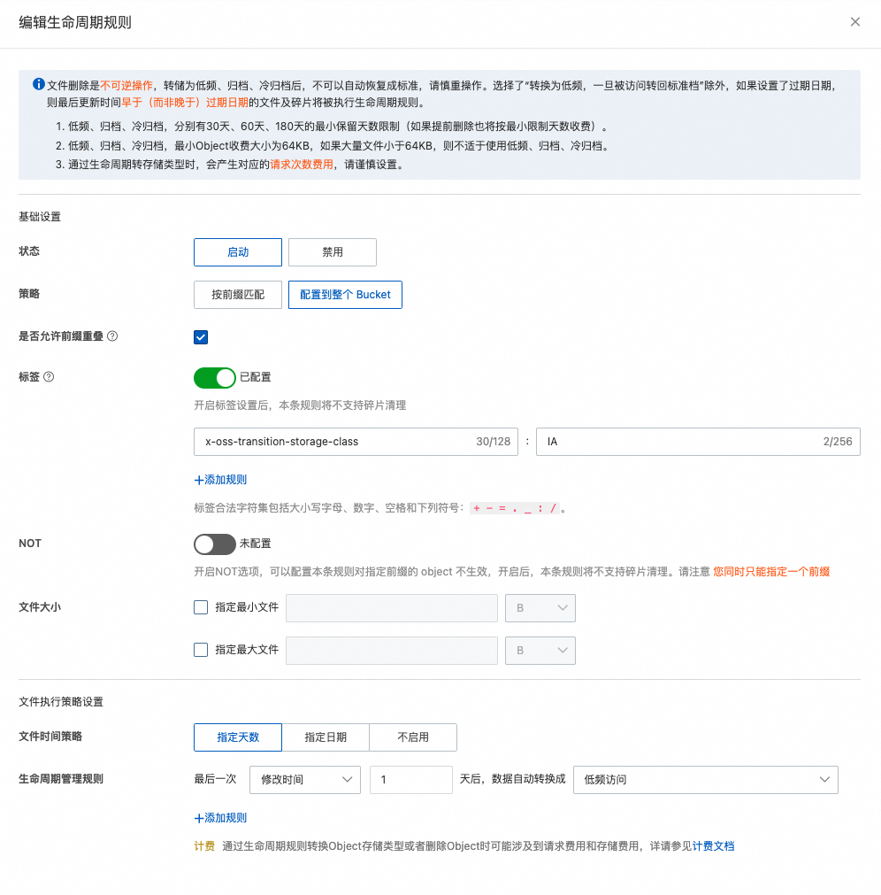
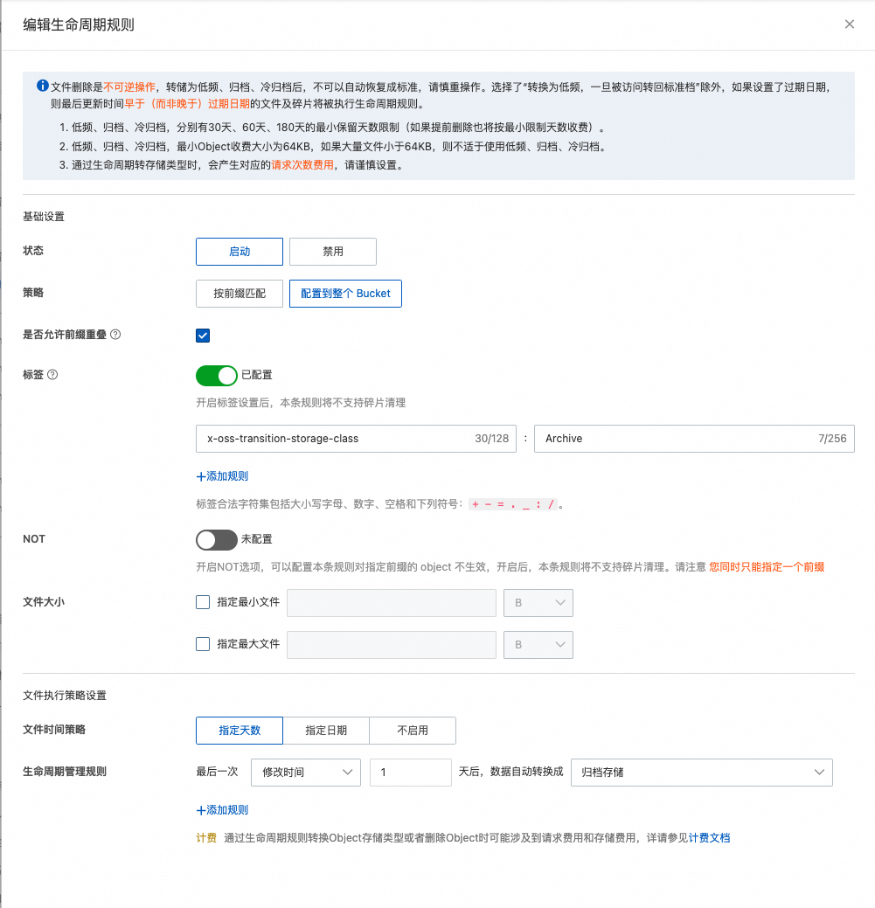
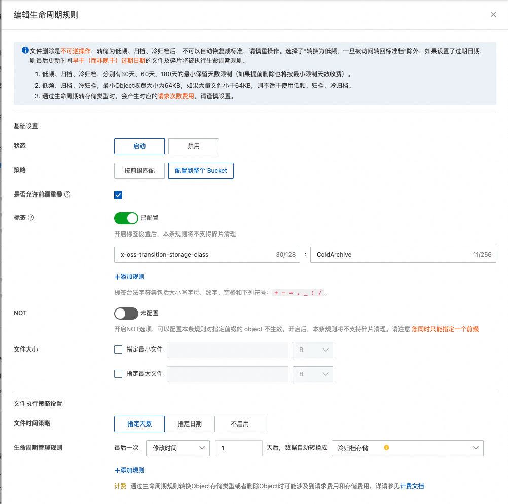

# Using JindoTable to Archive Hive Tables and Partition Data

## Usage Instructions

This command only supports conversion to Standard OSS storage type and does not support OSS-HDFS storage type conversions. For OSS-HDFS storage type conversions, refer to the [link](https://help.aliyun.com/zh/oss/user-guide/enable-the-automatic-storage-tiering-feature-for-the-oss-hdfs-service).

## Configuring OSS Lifecycle Policies

#### Setting Low-frequency Lifecycle Policy



#### Setting Archival Lifecycle Policy



#### Setting Cold Archival Lifecycle Policy



## Retrieving Help Information

Run the following command to get help information:

```
jindotable help -setStorageClass
```

## Parameters Explained

```shell
[-setStorageClass -t <dbName.tableName> -i/-a/-ca[-c "<condition>" | -fullTable] [-b/-before <before days>] [-p/-parallel <parallelism>] [-mr/-mapReduce] [-e/-explain] [-w/-workingDir <working directory>] [-l/-logDir <log directory>]]
```

| Parameter | Description | Mandatory |
| --- | --- | --- |
| `-t <dbName.tableName>` | The table to modify. | Yes |
| `-i/-a/-ca` | Specify the storage class: -i for Infrequent Access, -a for Archive, and -ca for Cold Archive. | Yes |
| `-c "<condition>" / -fullTable` | Partition filter condition expression, supporting basic operators but not UDFs. | No |
| `-b/before <before days>` | Move partitions created before the given number of days. | No |
| `-p/-parallel <parallelism>` | Max task concurrency for the moveTo operation; default is 1. | No |
| `-e/-explain` | Explain mode; doesn't execute the operation, just prints partitions that would be affected. | No |
| `-w/-workingDir` | Specify working directory for distributed copy. | No |
| `-l/-logDir <log directory>` | Local log directory; defaults to `/tmp/<current user>/`. | No |

## Usage Example

```bash
jindotable  -setStorageClass -t data_center.test_partition -ca -c "date_id > '20240110'"
```

Output:
