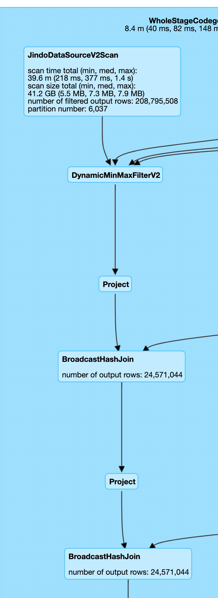

# 使用 JindoTable Native Engine 加速 Spark 读取 Parquet 效果
## 概述
JindoTable 完成了对 Paruqet 格式的第一阶段优化，我们使用 Spark 引擎对 JindoTable +
Native Engine 新方案和现有的 Apache Spark 的 Parquet 方案使用 TPC-DS 做了基准测试。这个测试用的是
JindoFS cache 模式, 纯读 OSS 。

测试结果表明，TPCDS 5T 规模的 Spark 测试，使用 JindoTable + Native Engine，平均 query 查询性能整体上较现有基于
Apache Spark 的方案提升22.9%, 总时间缩短10%。加速效果最高提升329%(q76). 其中, Native Engine 带来的提升20.4%,
总时间缩短9%。加速效果最高提升166%(q90)

约束条件
* 可用区：上海 
* 基准测试工具：TPC-DS/5TB , 合并过小文件(Native Engine有小文件优势) 
* TPC-DS测试Query不能有任何修改 
* 对比查询结果完全一致

## 测试环境

### 集群环境

|EMR主版本    |软件名称|    软件版本    |
| --- | --- | --- | 
|EMR-3.35 |    Spark|    2.4.7|
| |Hive|    2.3.7|
| |Hadoop|    2.8.5 |
| |SmartData|    3.5.0|

### 集群配置

|类型|    规格|    数量|    配置 |
| --- | --- | --- | --- |
|master|    ecs.g6e.8xlarge    |1|     CPU: 32核 内存: 128GB 数据盘配置: 200GB ESSD云盘*1|
|core|    ecs.i2gne.16xlarge|    4|    CPU: 64核 内存: 256GB 数据盘配置: 1788GB 本地盘*4|

## Spark 性能测试

### 参数

|  |  |
| --- | --- |
|--driver-memory|    32G
|--executor-memory|    16G/15G(native)
|--executor-cores|    5
|spark.sql.autoBroadcastJoinThreshold|    10M
|spark.sql.adaptiveBroadcastJoinThreshold|    10M
|spark.yarn.executor.memoryOverhead    |4g/5G(native)
|spark.sql.cbo.enabled|    false
|spark.sql.crossJoin.enabled|    true
|spark.sql.uncorrelated.scalar.subquery.preexecution.enabled|    false
|spark.sql.adaptive.maxNumPostShufflePartitions|    2000

### 测试结果

TPCDS Spark vs Native Engine

Q96 detail :

端到端计算时间从提交查询到拿到结果:

|query|spark|native engine|提升|
| --- | --- | ---- | ---- |
1|28.034|25.896|8.3%        |
2|93.928|36.063|160.5%      |
3|7.7|5.485|40.4%           |
4|479.66|465.048|3.1%       |
5|79.063|74.225|6.5%        |
6|20.044|19.495|2.8%        |
7|13.586|8.902|52.6%        |
8|10.945|9.913|10.4%        |
9|186.788|127.599|46.4%     |
10|30.507|30.534|-0.1%      |
11|101.168|94.055|7.6%      |
12|2.68|2.378|12.7%         |
13|23.894|10.607|125.3%     |
14a|245.065|242.674|1.0%    |
14b|187.429|191.754|-2.3%   |
15|13.647|12.811|6.5%       |
16|93.229|67.359|38.4%      |
17|26.573|25.019|6.2%       |
18|33.61|26.253|28.0%       |
19|8.102|6.94|16.7%         |
20|3.115|2.682|16.1%        |
21|1.22|1.187|2.8%          |
22|2.585|2.347|10.1%        |
23a|420.335|405.768|3.6%    |
23b|321.692|317.942|1.2%    |
24a|1019.94|996.839|2.3%    |
24b|1010.404|968.772|4.3%   |
25|21.368|19.234|11.1%      |
26|10.963|6.733|62.8%       |
27|13.525|8.67|56.0%        |
28|129.574|94.512|37.1%     |
29|67.651|62.958|7.5%       |
30|22.632|21.91|3.3%        |
31|32.462|27.451|18.3%      |
32|14.958|11.066|35.2%      |
33|6.004|4.869|23.3%        |
34|13.852|11.905|16.4%      |
35|51.784|51.002|1.5%       |
36|11.216|8.16|37.5%        |
37|30.486|29.816|2.2%       |
38|139.288|108.074|28.9%    |
39a|2.068|1.995|3.7%        |
39b|1.794|1.576|13.8%       |
40|18.532|16.015|15.7%      |
41|0.954|0.763|25.0%        |
42|2.871|1.895|51.5%        |
43|7.633|7.974|-4.3%        |
44|49.196|34.822|41.3%      |
45|11.523|10.717|7.5%       |
46|18.594|13.793|34.8%      |
47|25.136|23.938|5.0%       |
48|19.362|10.455|85.2%      |
49|25.425|12.307|106.6%     |
50|196.813|169.927|15.8%    |
51|33.333|34.648|-3.8%      |
52|2.871|1.932|48.6%        |
53|6.08|5.166|17.7%         |
54|15.593|13.155|18.5%      |
55|2.919|3.236|-9.8%        |
56|5.181|4.343|19.3%        |
57|14.629|12.706|15.1%      |
58|40.141|31.717|26.6%      |
59|56.748|34.12|66.3%       |
60|5.779|4.85|19.2%         |
61|10.281|8.231|24.9%       |
62|8.106|8.178|-0.9%        |
63|5.196|4.075|27.5%        |
64|390.287|372.584|4.8%     |
65|28.929|28.219|2.5%       |
66|23.298|18.285|27.4%      |
67|172.87|170.702|1.3%      |
68|10.905|9.628|13.3%       |
69|27.904|26.169|6.6%       |
70|16.877|16.637|1.4%       |
71|8.676|7.076|22.6%        |
72|138.164|133.097|3.8%     |
73|6.463|5.496|17.6%        |
74|81.695|77.013|6.1%       |
75|114.589|108.966|5.2%     |
76|143.072|33.286|329.8%    |
77|9.501|6.452|47.3%        |
78|247.764|241.267|2.7%     |
79|14.6|11.119|31.3%        |
80|70.719|62.848|12.5%      |
81|27.86|25.978|7.2%        |
82|52.902|55.44|-4.6%       |
83|10.876|4.954|119.5%      |
84|11.071|9.422|17.5%       |
85|24.741|16.707|48.1%      |
86|6.351|5.473|16.0%        |
87|119.876|120.161|-0.2%    |
88|200.585|84.934|136.2%    |
89|9.392|6.656|41.1%        |
90|23.878|8.955|166.6%      |
91|6.805|4.87|39.7%         |
92|9.358|7.675|21.9%        |
93|352.202|343.281|2.6%     |
94|45.865|44.82|2.3%        |
95|0|0|0.0%                 |
96|23.212|11.483|102.1%     |
97|92.636|92.889|-0.3%      |
98|4.062|4.713|-13.8%       |
99|13.536|14.887|-9.1%      |
总时间|8158.985|7309.583
总体时间提升:|12%||
平均提升(GeoMean)|22.9%||

JindoTable 优化了dynamic partition pruning, 为了更直观看到Native
Engine提升,去掉干扰查的查询q2_0,q23b_0,q28,q38,q50_0,q59_0,q64_0,q67_0,q76_0 之后:

|query|spark|native engine|提升|
| ---- | ---- | ---- | ----|
|1|28.034|25.896|8.3%          |
|3|7.7|5.485|40.4%             |
|4|479.66|465.048|3.1%         |
|5|79.063|74.225|6.5%          |
|6|20.044|19.495|2.8%          |
|7|13.586|8.902|52.6%          |
|8|10.945|9.913|10.4%          |
|9|186.788|127.599|46.4%       |
|10|30.507|30.534|-0.1%        |
|11|101.168|94.055|7.6%        |
|12|2.68|2.378|12.7%           |
|13|23.894|10.607|125.3%       |
|14a|245.065|242.674|1.0%      |
|14b|187.429|191.754|-2.3%     |
|15|13.647|12.811|6.5%         |
|16|93.229|67.359|38.4%        |
|17|26.573|25.019|6.2%         |
|18|33.61|26.253|28.0%         |
|19|8.102|6.94|16.7%           |
|20|3.115|2.682|16.1%          |
|21|1.22|1.187|2.8%            |
|22|2.585|2.347|10.1%          |
|23a|420.335|405.768|3.6%      |
|24a|1019.94|996.839|2.3%      |
|24b|1010.404|968.772|4.3%     |
|25|21.368|19.234|11.1%        |
|26|10.963|6.733|62.8%         |
|27|13.525|8.67|56.0%          |
||
|29|67.651|62.958|7.5%         |
|30|22.632|21.91|3.3%          |
|31|32.462|27.451|18.3%        |
|32|14.958|11.066|35.2%        |
|33|6.004|4.869|23.3%          |
|34|13.852|11.905|16.4%        |
|35|51.784|51.002|1.5%         |
|36|11.216|8.16|37.5%          |
|37|30.486|29.816|2.2%         |
||
|39a|2.068|1.995|3.7%          |
|39b|1.794|1.576|13.8%         |
|40|18.532|16.015|15.7%        |
|41|0.954|0.763|25.0%          |
|42|2.871|1.895|51.5%          |
|43|7.633|7.974|-4.3%          |
|44|49.196|34.822|41.3%        |
|45|11.523|10.717|7.5%         |
|46|18.594|13.793|34.8%        |
|47|25.136|23.938|5.0%         |
|48|19.362|10.455|85.2%        |
|49|25.425|12.307|106.6%       |
||
|51|33.333|34.648|-3.8%        |
|52|2.871|1.932|48.6%          |
|53|6.08|5.166|17.7%           |
|54|15.593|13.155|18.5%        |
|55|2.919|3.236|-9.8%          |
|56|5.181|4.343|19.3%          |
|57|14.629|12.706|15.1%        |
|58|40.141|31.717|26.6%        |
||
|60|5.779|4.85|19.2%           |
|61|10.281|8.231|24.9%         |
|62|8.106|8.178|-0.9%          |
|63|5.196|4.075|27.5%          |
||
|65|28.929|28.219|2.5%         |
|66|23.298|18.285|27.4%        |
||
|68|10.905|9.628|13.3%         |
|69|27.904|26.169|6.6%         |
|70|16.877|16.637|1.4%         |
|71|8.676|7.076|22.6%          |
|72|138.164|133.097|3.8%       |
|73|6.463|5.496|17.6%          |
|74|81.695|77.013|6.1%         |
|75|114.589|108.966|5.2%       |
||
|77|9.501|6.452|47.3%          |
|78|247.764|241.267|2.7%       |
|79|14.6|11.119|31.3%          |
|80|70.719|62.848|12.5%        |
|81|27.86|25.978|7.2%          |
|82|52.902|55.44|-4.6%         |
|83|10.876|4.954|119.5%        |
|84|11.071|9.422|17.5%         |
|85|24.741|16.707|48.1%        |
|86|6.351|5.473|16.0%          |
|87|119.876|120.161|-0.2%      |
|88|200.585|84.934|136.2%      |
|89|9.392|6.656|41.1%          |
|90|23.878|8.955|166.6%        |
|91|6.805|4.87|39.7%           |
|92|9.358|7.675|21.9%          |
|93|352.202|343.281|2.6%       |
|94|45.865|44.82|2.3%          |
|95|0|0|0.0%                   |
|96|23.212|11.483|102.1%       |
|97|92.636|92.889|-0.3%        |
|98|4.062|4.713|-13.8%         |
|99|13.536|14.887|-9.1%        |
|总时间|6514.713|5972.373|9.1%    |
|总体时间提升:|9.1%||
|平均提升(GeoMean)|20.4%||

结论: 最高提升166% 平均提速20.4% 总时间减少9%
